# Hi, I'm Ali 👋

I'm a developer interested in building things across **software, embedded systems, and the web**.

I enjoy experimenting with **ESP32 and electronics**, building **Python applications and bots**, and creating small **web projects**.

## Currently

I'm working on different personal projects and experimenting with new ideas across software and hardware.

One of them is **[Wiretap](https://github.com/renger08/Wiretap)** — a browser-based ambient recreation of the surveillance interface from *The Wire*.

You can also **[try the live demo](https://wiretap.thealinabati.ir/)**.

## Tech Stack

**Languages & Development**

`Python` · `C/C++` · `JavaScript` · `HTML` · `CSS`

**Embedded**

`ESP32` · `Arduino` · `PlatformIO`

**Tools & Platforms**

`Git` · `GitHub` · `Linux` · `Docker`

## GitHub Stats

## Website

🌐 **[thealinabati.ir](https://thealinabati.ir/)**
